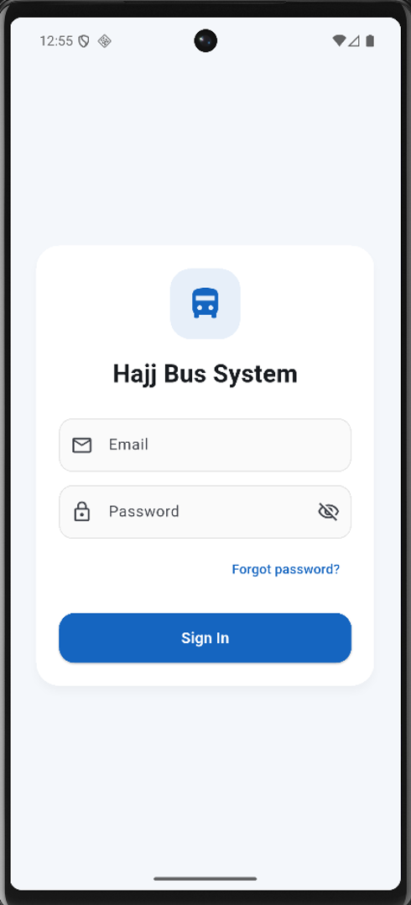
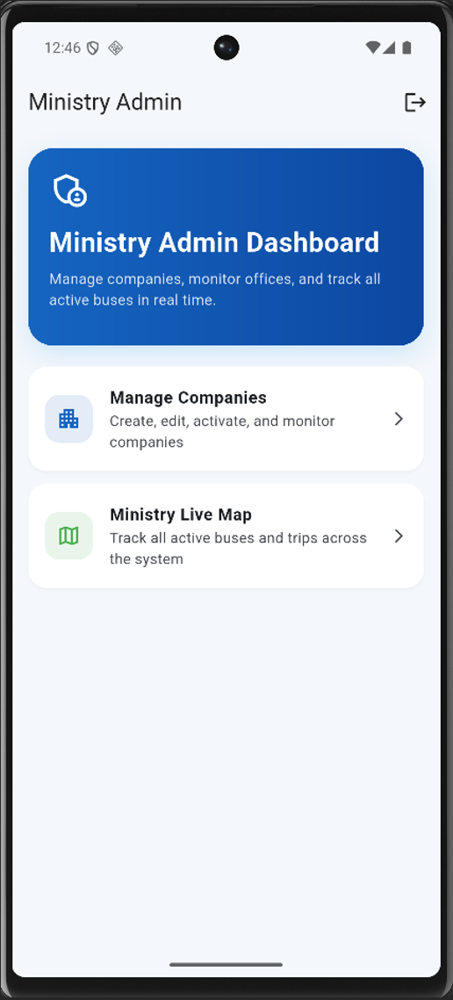
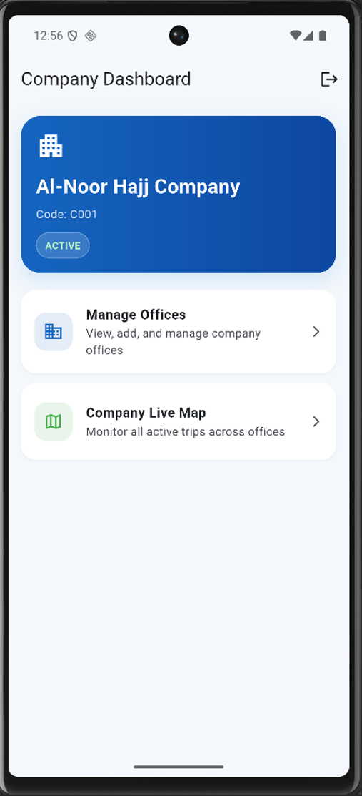
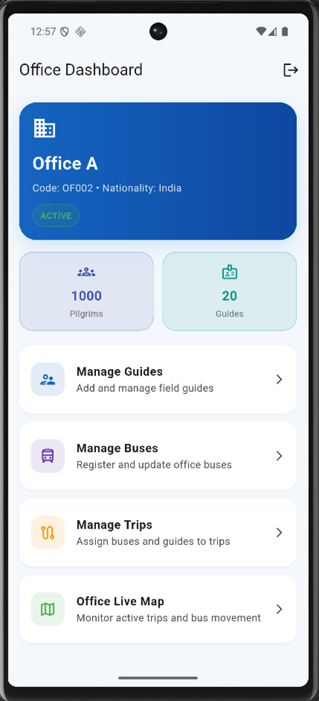
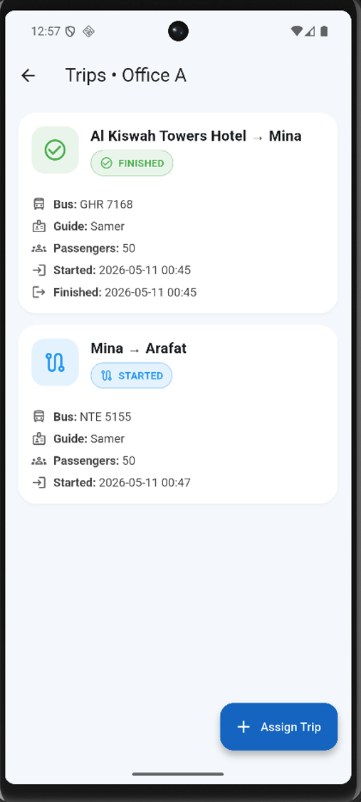
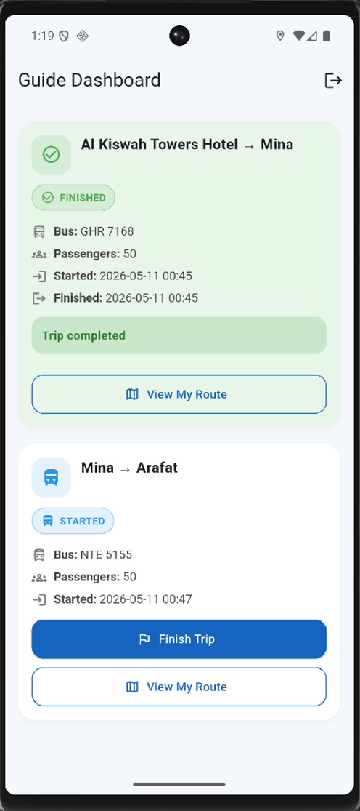
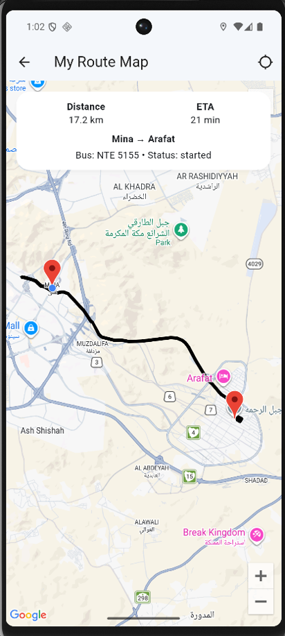
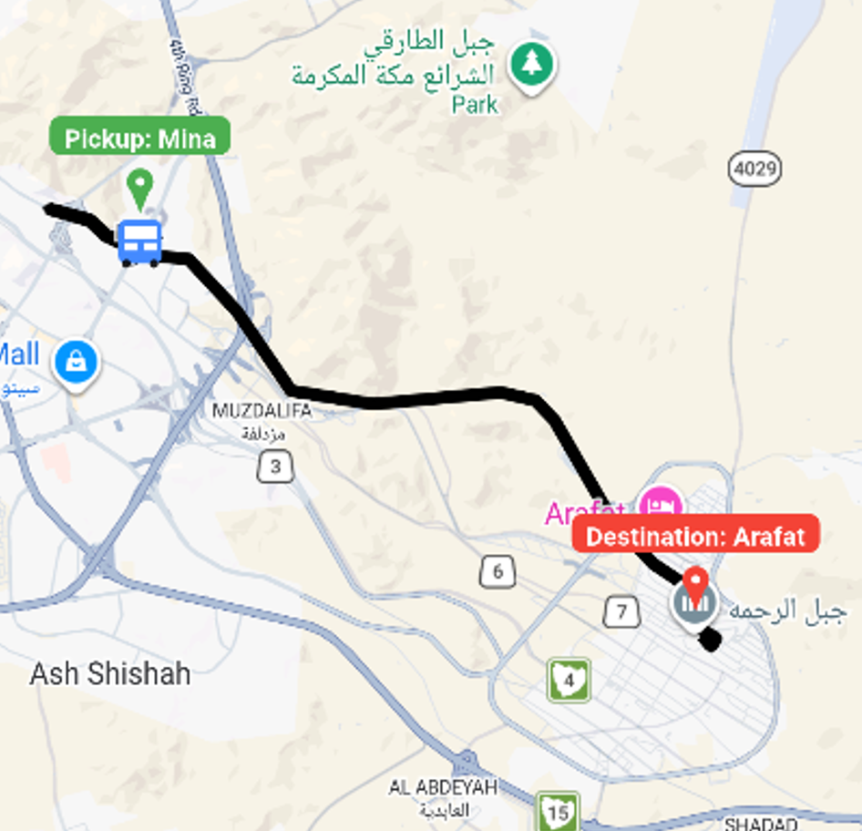

# Hajj Bus Management System (HBMS)

## Overview

The Hajj Bus Management System (HBMS) is a mobile-based transportation management platform developed to support Hajj transportation operations through centralized monitoring, trip management, and real-time bus tracking.

The system enables ministries, transportation companies, offices, and field guides to manage transportation activities through a unified platform. HBMS was developed as a capstone project at King Abdulaziz University using Flutter, Firebase, and Google Maps technologies.

> **Note:** This repository is a showcase repository and does not contain the source code. The implementation repository remains private.

---

## Problem Statement

Managing transportation during Hajj involves coordinating large numbers of buses, guides, transportation offices, and companies. Traditional approaches often rely on manual processes and fragmented communication, making it difficult to monitor operations and respond to issues in real time.

HBMS addresses these challenges by providing:

* Centralized transportation management
* Real-time bus tracking
* Role-based access control
* Trip lifecycle management
* Live operational monitoring

---

## Key Features

### Role-Based Access Control (RBAC)

The system supports four user roles:

* Ministry Administrator
* Company Administrator
* Office Administrator
* Field Guide

Each role has permissions tailored to its operational responsibilities.

### Company Management

* Manage transportation companies
* View company information
* Monitor company operations

### Office Management

* Manage transportation offices
* Organize guides, buses, and trips
* Monitor office-level activities

### Guide Management

* Assign guides to trips
* Manage guide information
* Track guide-related operations

### Bus Management

* Register and manage buses
* Track bus status
* Assign buses to trips

### Trip Management

* Create trips
* Assign buses and guides
* Monitor trip status
* Record trip lifecycle events

### Real-Time GPS Tracking

* Continuous location updates
* Live monitoring through Cloud Firestore
* Synchronization across dashboards

### Google Maps Integration

* Route visualization
* Live bus tracking
* Location monitoring

### Background Tracking

* Location updates continue while trips are active
* Supports real-time operational visibility

---

## System Architecture

The application follows a layered architecture consisting of:

### Presentation Layer

* Flutter Mobile Application
* Ministry Dashboard
* Company Dashboard
* Office Dashboard
* Guide Dashboard

### Application Layer

* Authentication
* Role-Based Access Control
* Company Management
* Office Management
* Guide Management
* Bus Management
* Trip Management
* Tracking Services

### Data Layer

* Cloud Firestore
* User Management
* Transportation Data

### External Services

* Firebase Authentication
* Google Maps API
* Google Routes API
* Geolocator Services

---

## Technology Stack

### Mobile Development

* Flutter
* Dart

### Backend & Cloud

* Firebase Authentication
* Cloud Firestore

### Maps & Tracking

* Google Maps API
* Google Routes API
* Geolocator

### Development Tools

* Git
* GitHub
* Android Studio
* Visual Studio Code

---

## Database Structure

### Main Collections

```text
companies
 └ offices
    ├ buses
    ├ guides
    └ trips

users
```

The database was designed using Cloud Firestore to support real-time synchronization, scalability, and role-based access control.

---

## Screenshots

### Login Screen



### Ministry Dashboard



### Company Dashboard



### Office Dashboard



### Trip Management



### Guide Dashboard



### Guide Route



### Live Tracking



---

## Design Artifacts

The repository includes:

* ER Diagram
* Use Case Diagram
* Class Diagram
* Activity Diagrams

These artifacts demonstrate the design and implementation approach used throughout the project lifecycle.

---

## Project Outcomes

The project successfully achieved the following objectives:

* Centralized transportation management
* Real-time bus tracking
* Role-based access control
* Trip lifecycle management
* Dashboard-based monitoring
* Route visualization using Google Maps
* Scalable cloud-based architecture

---

## Academic Information

**Project Title:** Hajj Bus Management System (HBMS)

**Institution:** King Abdulaziz University

**Program:** Bachelor of Science in Information Technology

**Course:** CPIT 498 / CPIT 499 Graduation Project

**Development Methodology:** Agile Software Development

---

## Source Code

The implementation repository is private.

This repository is intended to showcase the project's architecture, design artifacts, screenshots, and technical overview without distributing the application source code.

---

## Authors

* Abdulrahman Khalid Alkhathlan
* Abdulrahman Faiz Bugis

King Abdulaziz University
